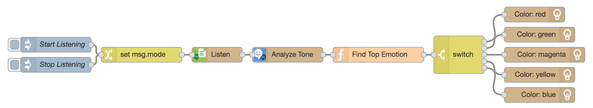
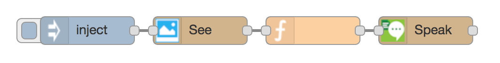

# Node-RED TJBot

The following labs are independent exercises that show how to control the TJBot using nodes in Node-RED and construct flows that can be used and expanded in larger projects.

## Getting Started

For instructions on setting up the Raspberry Pi, upgrading Node-RED, and installing the Node-RED nodes needed for these labs, please refer to this [Medium post](https://medium.com/@jeancarlbisson/how-to-train-your-tjbot-in-node-red-88bfb3bbe0ab).

## Emotional Light

[Project Resources](emotional-light) | [PDF](emotional-light/node-red-tjbot-emotional-light.pdf)

_Uses_: Microphone, LED, Watson Speech to Text, Watson Tone Analyzer

Train TJBot to listen to phrases and analyze the emotional tone using Watson Tone Analyzer. Depending on which emotion is most prevalent in the phrase, the LED will change to represent that emotion.

## Say What I See

[Project Resources](say-what-i-see) | [PDF](say-what-i-see/node-red-tjbot-say-what-i-see.pdf)

_Uses_: Camera, Speaker, Watson Visual Recognition, Watson Text to Speech

Train TJBot to take a photo with the Raspberry Pi, classify it with Watson Visual Recognition, and speak what objects and colors are seen with Watson Text to Speech and the speaker.

## License

This code is licensed under Apache 2.0. Full license text is available in [LICENSE](LICENSE).
